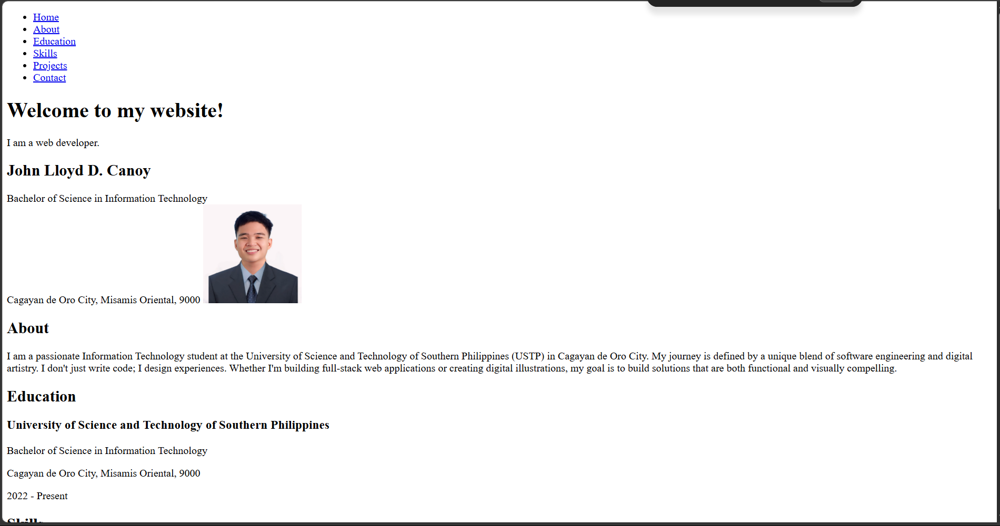
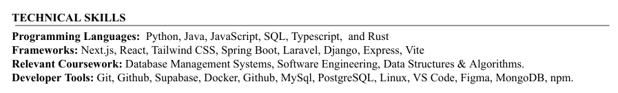
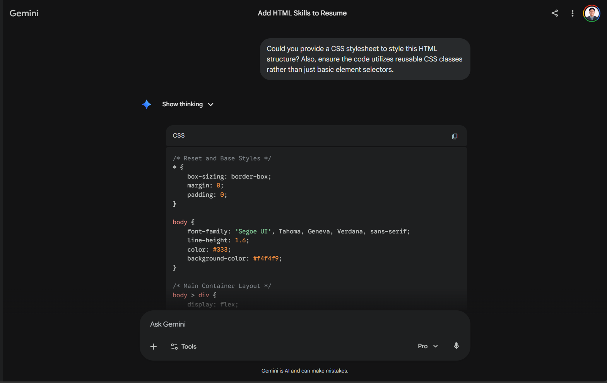
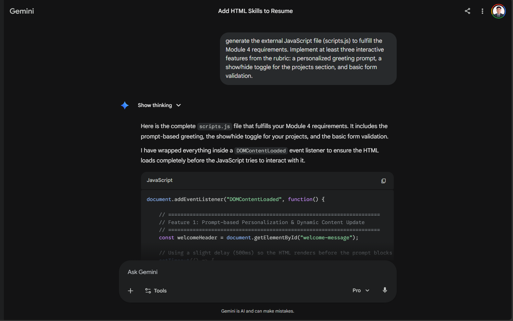
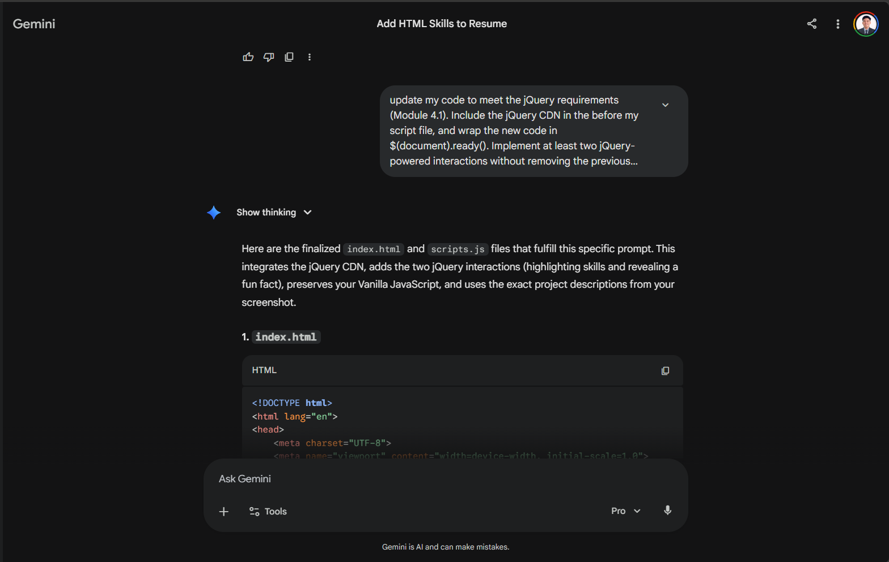
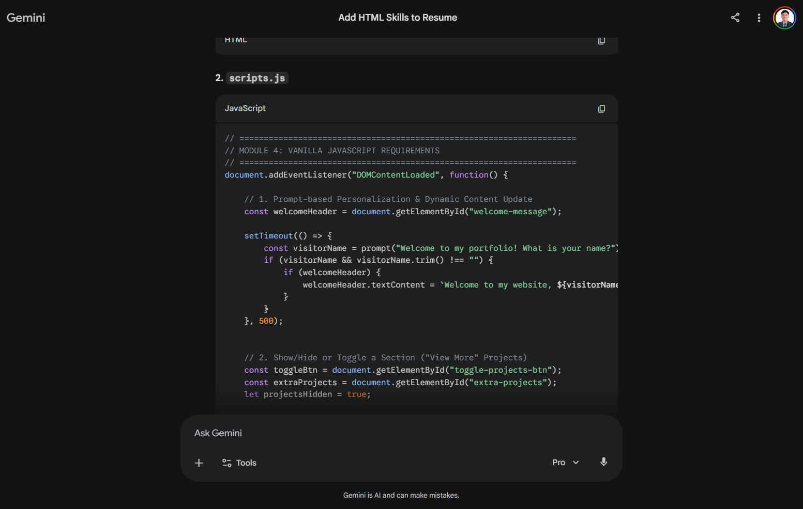

# Appendix B: AI Prompt Log

**Before the AI Prompt**

**Entry #1**
* **Tool Used:** Gemini

* **Prompt :**  update the current HTML code to include the Skills section and the Contact section. Within the Contact section, add a functional HTML contact form containing fields for Name, Email, and Message, along with a 'Send' button
* **AI Output (summary or screenshot reference):** Gemini provided the foundational HTML structure, sequentially adding the Skills list, Projects list, Contact information, and an HTML form for the contact section within semantic `<section>` tags.
* **How I used/modified it in my project:** I used this as the base `index.html` file for the portfolio, ensuring all my personal text from my resume was accurately transcribed into web format.

**Entry #2**
* **Tool Used:** Gemini

* **Prompt :** Could you provide a CSS stylesheet to style this HTML structure? Also, ensure the code utilizes reusable CSS classes rather than just basic element selectors.
* **AI Output :** Gemini generated a complete `styles.css` file providing a clean, modern layout. It refactored both the HTML and CSS to use reusable classes like `.resume-section`, `.item-list`, and `.btn-primary`.
* **How I used/modified it in my project:** I linked this CSS file to my HTML document to style the layout, center the main content, and format the buttons and navigation bar.

**Entry #3**
* **Tool Used:** Gemini

* **Prompt :** generate the external JavaScript file (scripts.js) to fulfill the Module 4 requirements. Implement at least three interactive features from the rubric: a personalized greeting prompt, a show/hide toggle for the projects section, and basic form validation.
* **AI Output :** Gemini generated vanilla JavaScript wrapped in a DOMContentLoaded event listener. The code included a prompt() function for a personalized welcome message, DOM manipulation logic to toggle the visibility of the projects section, and conditional logic for basic contact form validation to prevent empty submissions.
* **How I used/modified it in my project:** I integrated this code into my scripts.js file. I reviewed and adapted the DOM manipulation methods (such as getElementById, textContent, and style.display) to ensure they correctly targeted the specific HTML elements and ID names used in my web resume.

**Entry #4**
* **Tool Used:** Gemini

* **Prompt :** update my code to meet the jQuery requirements (Module 4.1). Include the jQuery CDN in the <head> before my script file, and wrap the new code in $(document).ready(). Implement at least two jQuery-powered interactions without removing the previous Vanilla JS features. Also, ensure the project descriptions perfectly match the provided image.
* **AI Output :** Gemini provided the updated index.html with the proper jQuery CDN link and added new interactive buttons. It also appended a $(document).ready() block to scripts.js, implementing a .toggleClass() function to highlight core skills and a combined .append(), .show(), and .hide() sequence to dynamically reveal a hidden 'fun fact'.
* **How I used/modified it in my project:** I incorporated these updates into my project files, verifying that the jQuery CDN loaded strictly prior to my custom script. I tested the site thoroughly to ensure that the new jQuery interactions (Module 4.1) functioned seamlessly alongside the existing Vanilla JavaScript features (Module 4) without any code conflicts.